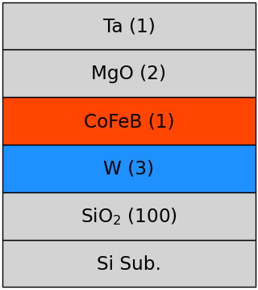
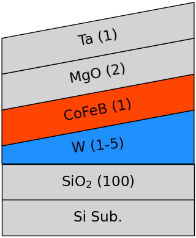

# Stack Schematic Generator

`stack_schematic_generator` is a Python package for easily generating schematic diagrams of multilayer (stack) structures using matplotlib.

## Installation

```bash
pip install git+https://github.com/y-marui/stack-schematic-generator.git
```

## Usage

```python
from stack_schematic_generator.stack import Stack
from stack_schematic_generator.layer import Layer
import matplotlib.pyplot as plt

with plt.style.context(['matplotlib_extension.article', 'stack_schematic_generator.stack_schematic']):
    stack = Stack([
        Layer("Si Sub.", "lightgray"),
        Layer("SiO$_2$ (100)", "lightgray"),
        Layer("W (3)", "dodgerblue"),
        Layer("CoFeB (1)", "orangered"),
        Layer("MgO (2)", "lightgray"),
        Layer("Ta (1)", "lightgray"),
    ])
    stack.plot()
    plt.show()
```

<div align="center">
    
</div>

```
with plt.style.context(['matplotlib_extension.article', 'stack_schematic_generator.stack_schematic']):
    stack = Stack([
        Layer("Si Sub.", "lightgray"),
        Layer("SiO$_2$ (100)", "lightgray"),
        Layer("W (1-5)", "dodgerblue", height=0.5, slope= 1),
        Layer("CoFeB (1)", "orangered"),
        Layer("MgO (2)", "lightgray"),
        Layer("Ta (1)", "lightgray"),
    ])
    stack.plot()
    plt.show()
```

<div align="center">
    
</div>

## License

MIT License
